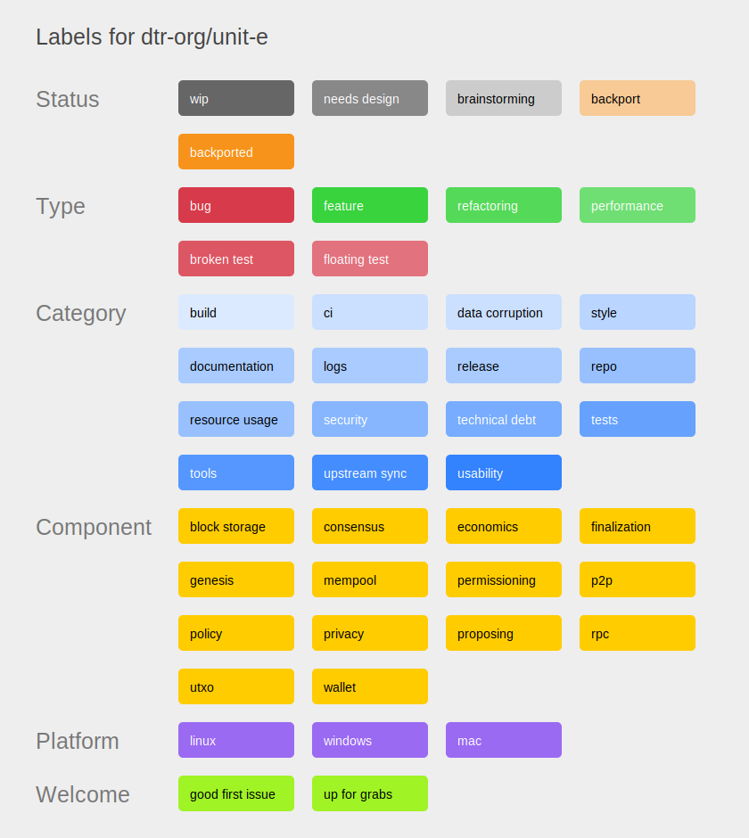

Developer Notes
===============

Style guide C++
---------------

Various coding styles have been used during the history of the codebase,
and the result is not very consistent. However, we're now trying to converge to
a single style. We are sticking to the
[Google C++ Style Guide](https://google.github.io/styleguide/cppguide.html).

This includes aiming for a [maximum line length of 80
characters](https://google.github.io/styleguide/cppguide.html#Line_Length).

There are a few additional rules:

- **Symbol naming conventions**. These are preferred in new code, but are not
required when doing so would need changes to significant pieces of existing
code.
  - Variable (including function arguments) and namespace names are all lowercase, and may use _ to separate words (snake_case).
    - Class member variables have a `m_` prefix.
    - Public struct member variables don't have `m_` prefix.
    - Global variables have a `g_` prefix.
  - Constant names are all uppercase, and use `_` to separate words.
  - Class names, function names and method names are UpperCamelCase
    (PascalCase). Do not prefix class names with `C`.

- **Includes**. Make sure to always use `<>` notation instead of the "".
  This is done mostly for consistency with the current codebase.

- **Forward declarations**. Forward declarations of classes and structs are allowed and welcome,
especially when they solve circular dependencies problem or increase recompilation time. But note that
forward declarations of functions and templated classes are prohibited according to Google Style Guide.

- **If-Statements**.
    - Always use braces around if statements, even blocks
      that contain just one statement.
    - Prefer early return as a guard clause
      ```c++
      if (!smth) {
        return;
      }

      // continue with the valid case
      ```

- **namespace**.
    - files in `src/` don't have namespace
    - files in `src/directory` have `directory` namespace
    - avoid nested directories/namespaces

- **Uniform initialization**. Rationale:
  [Uniform initialization isn't](https://medium.com/@barryrevzin/uniform-initialization-isnt-82533d3b9c11).
  - In call sites: *Use parentheses to initialize in all cases. Use braces only for the specific behavior that braces provide.*
  - When declaring classes: *Avoid writing class interfaces in which an ambiguity between uniform initialization and list-initializer syntax might arise.*

- **Miscellaneous**
  - `++i` is preferred over `i++`.
  - `nullptr` is preferred over `NULL` or `(void*)0`.
  - `static_assert` is preferred over `assert` where possible. Generally; compile-time checking is preferred over run-time checking.
  - Do not use the scope resolution unless it is required (that is: use `Type` instead of `::Type` if not ambigious otherwise)

You can check the code for style violations by running
[`contrib/devtools/lint-clang-format.py`](../contrib/devtools/lint-clang-format.py).
Use the `--help` option to get more info how to use it.

Copy the [`contrib/githooks/pre-commit`](../contrib/githooks/pre-commit) file to
your `.git/hooks` directory and make it executable to automatically apply the
defined style on your commits. If you don't want automatic changes, adapt the
options of the call in the `pre-commit` file.

Style guide Python
------------------

Refer to
[/test/functional/README.md#style-guidelines](/test/functional/README.md#style-guidelines).
You can check the code for style violations by running
[`test/lint/lint-python.sh`](/test/lint/lint-python.sh).

UNIT-E tag
------------

In case of comments and TODOs that are pertinent only to the UNIT-E code please create a code comment like:

```
//UNIT-E: very specific comment about unit-e
```

Doxygen comments
-----------------

To facilitate the generation of documentation, use doxygen-compatible comment blocks for functions, methods and fields.

For example, to describe a function use:

```c++
//! \brief one-line description
//!
//! ... optional long description ...
//! @param[in] arg1    A description
//! @param[in] arg2    Another argument description
//! @pre Precondition for function...
bool function(int arg1, const char *arg2) {
```

To describe a class use the same construct above the class definition:

```c++
//! \brief one-line description
//!
//! Alerts are for notifying old versions if they become too obsolete and
//! need to upgrade. The message is displayed in the status bar.
//! @see GetWarnings()
class CAlert {
```

To describe a member or variable use:

```c++
//! Detailed description
int var;
```

Not OK (used plenty in the current source, but not picked up):

```c++
//
// ... text ...
//
```

A full list of comment syntaxes picked up by doxygen can be found at http://www.stack.nl/~dimitri/doxygen/manual/docblocks.html,
but if possible use one of the above styles.

Documentation can be generated with `make docs` and cleaned up with `make
clean-docs`.

Development tips and tricks
---------------------------

**compiling for debugging**

Run configure with the --enable-debug option, then make. Or run configure with
CXXFLAGS="-g -ggdb -O0" or whatever debug flags you need.

**compiling for gprof profiling**

Run configure with the --enable-gprof option, then make.

**debug.log**

If the code is behaving strangely, take a look in the debug.log file in the data directory;
error and debugging messages are written there.

The -debug=... command-line option controls debugging; running with just -debug or -debug=1 will turn
on all categories (and give you a very large debug.log file).

**testnet and regtest modes**

Run with the -testnet option to run with "play unites" on the test network, if you
are testing multi-machine code that needs to operate across the internet.

If you are testing something that can run on one machine, run with the -regtest option.
In regression test mode, blocks can be created on-demand; see test/functional/ for tests
that run in -regtest mode.

**DEBUG_LOCKORDER**

unit-e is a multithreaded application, and deadlocks or other multithreading bugs
can be very difficult to track down. Compiling with -DDEBUG_LOCKORDER (configure
CXXFLAGS="-DDEBUG_LOCKORDER -g") inserts run-time checks to keep track of which locks
are held, and adds warnings to the debug.log file if inconsistencies are detected.

**Valgrind suppressions file**

Valgrind is a programming tool for memory debugging, memory leak detection, and
profiling. The repo contains a Valgrind suppressions file
([`valgrind.supp`](https://github.com/dtr-org/unit-e/blob/master/contrib/valgrind.supp))
which includes known Valgrind warnings in our dependencies that cannot be fixed
in-tree. Example use:

```shell
$ valgrind --suppressions=contrib/valgrind.supp src/test/test_unite
$ valgrind --suppressions=contrib/valgrind.supp --leak-check=full \
      --show-leak-kinds=all src/test/test_unite --log_level=test_suite
$ valgrind -v --leak-check=full src/unit-e -printtoconsole
```

**compiling for test coverage**

LCOV can be used to generate a test coverage report based upon `make check`
execution. LCOV must be installed on your system (e.g. the `lcov` package
on Debian/Ubuntu).

To enable LCOV report generation during test runs:

```shell
./configure --enable-lcov
make
make cov

# A coverage report will now be accessible at `./test_unite.coverage/index.html`.
```

**Sanitizers**

unit-e can be compiled with various "sanitizers" enabled, which add
instrumentation for issues regarding things like memory safety, thread race
conditions, or undefined behavior. This is controlled with the
`--with-sanitizers` configure flag, which should be a comma separated list of
sanitizers to enable. The sanitizer list should correspond to supported
`-fsanitize=` options in your compiler. These sanitizers have runtime overhead,
so they are most useful when testing changes or producing debugging builds.

Some examples:

```bash
# Enable both the address sanitizer and the undefined behavior sanitizer
./configure --with-sanitizers=address,undefined

# Enable the thread sanitizer
./configure --with-sanitizers=thread
```

If you are compiling with GCC you will typically need to install corresponding
"san" libraries to actually compile with these flags, e.g. libasan for the
address sanitizer, libtsan for the thread sanitizer, and libubsan for the
undefined sanitizer. If you are missing required libraries, the configure script
will fail with a linker error when testing the sanitizer flags.

The test suite should pass cleanly with the `thread` and `undefined` sanitizers,
but there are a number of known problems when using the `address` sanitizer. The
address sanitizer is known to fail in
[sha256_sse4::Transform](/src/crypto/sha256_sse4.cpp) which makes it unusable
unless you also use `--disable-asm` when running configure. We would like to fix
sanitizer issues, so please send pull requests if you can fix any errors found
by the address sanitizer (or any other sanitizer).

Not all sanitizer options can be enabled at the same time, e.g. trying to build
with `--with-sanitizers=address,thread` will fail in the configure script as
these sanitizers are mutually incompatible. Refer to your compiler manual to
learn more about these options and which sanitizers are supported by your
compiler.

Additional resources:

 * [AddressSanitizer](https://clang.llvm.org/docs/AddressSanitizer.html)
 * [LeakSanitizer](https://clang.llvm.org/docs/LeakSanitizer.html)
 * [MemorySanitizer](https://clang.llvm.org/docs/MemorySanitizer.html)
 * [ThreadSanitizer](https://clang.llvm.org/docs/ThreadSanitizer.html)
 * [UndefinedBehaviorSanitizer](https://clang.llvm.org/docs/UndefinedBehaviorSanitizer.html)
 * [GCC Instrumentation Options](https://gcc.gnu.org/onlinedocs/gcc/Instrumentation-Options.html)
 * [Google Sanitizers Wiki](https://github.com/google/sanitizers/wiki)
 * [Issue #12691: Enable -fsanitize flags in Travis](https://github.com/bitcoin/bitcoin/issues/12691)

Locking/mutex usage notes
-------------------------

The code is multi-threaded, and uses mutexes and the
LOCK/TRY_LOCK macros to protect data structures.

Deadlocks due to inconsistent lock ordering (thread 1 locks cs_main
and then cs_wallet, while thread 2 locks them in the opposite order:
result, deadlock as each waits for the other to release its lock) are
a problem. Compile with -DDEBUG_LOCKORDER to get lock order
inconsistencies reported in the debug.log file.

Re-architecting the core code so there are better-defined interfaces
between the various components is a goal, with any necessary locking
done by the components (e.g. see the self-contained CKeyStore class
and its cs_KeyStore lock for example).

Threads
-------

- ThreadScriptCheck : Verifies block scripts.

- ThreadImport : Loads blocks from blk*.dat files or bootstrap.dat.

- StartNode : Starts other threads.

- ThreadDNSAddressSeed : Loads addresses of peers from the DNS.

- ThreadMapPort : Universal plug-and-play startup/shutdown

- ThreadSocketHandler : Sends/Receives data from peers on port 7182.

- ThreadOpenAddedConnections : Opens network connections to added nodes.

- ThreadOpenConnections : Initiates new connections to peers.

- ThreadMessageHandler : Higher-level message handling (sending and receiving).

- DumpAddresses : Dumps IP addresses of nodes to peers.dat.

- ThreadFlushWalletDB : Close the wallet.dat file if it hasn't been used in 500ms.

- ThreadRPCServer : Remote procedure call handler, listens on port 7181 for connections and services them.

- unite-proposer : Proposes new blocks using the open wallets balance as stake.

- unite-snapshot : Creates snapshots and deletes outdated ones

- Shutdown : Does an orderly shutdown of everything.

Ignoring IDE/editor files
--------------------------

In closed-source environments in which everyone uses the same IDE it is common
to add temporary files it produces to the project-wide `.gitignore` file.

However, in open source software such as unit-e, where everyone uses
their own editors/IDE/tools, it is less common. Only you know what files your
editor produces and this may change from version to version. The canonical way
to do this is thus to create your local gitignore. Add this to `~/.gitconfig`:

```
[core]
        excludesfile = /home/.../.gitignore_global
```

(alternatively, type the command `git config --global core.excludesfile ~/.gitignore_global`
on a terminal)

Then put your favourite tool's temporary filenames in that file, e.g.
```
# NetBeans
nbproject/
```

Another option is to create a per-repository excludes file `.git/info/exclude`.
These are not committed but apply only to one repository.

If a set of tools is used by the build system or scripts the repository (for
example, lcov) it is perfectly acceptable to add its files to `.gitignore`
and commit them.

Development guidelines
============================

A few non-style-related recommendations for developers, as well as points to
pay attention to for reviewers of unit-e code.

General unit-e
----------------------

- Make sure pull requests pass Travis CI before merging

  - *Rationale*: Makes sure that they pass thorough testing, and that the tester will keep passing
     on the master branch. Otherwise all new pull requests will start failing the tests, resulting in
     confusion and mayhem

  - *Explanation*: If the test suite is to be updated for a change, this has to
    be done first

Wallet
-------

- Make sure that no crashes happen with run-time option `-disablewallet`.

  - *Rationale*: In RPC code that conditionally uses the wallet (such as
    `validateaddress`) it is easy to forget that global pointer `pwalletMain`
    can be nullptr. See `test/functional/disablewallet.py` for functional tests
    exercising the API with `-disablewallet`

- Include `db_cxx.h` (BerkeleyDB header) only when `ENABLE_WALLET` is set

  - *Rationale*: Otherwise compilation of the disable-wallet build will fail in environments without BerkeleyDB

General C++
-------------

- Assertions should not have side-effects

  - *Rationale*: Even though the source code is set to refuse to compile
    with assertions disabled, having side-effects in assertions is unexpected and
    makes the code harder to understand

- If you use the `.h`, you must link the `.cpp`

  - *Rationale*: Include files define the interface for the code in implementation files. Including one but
      not linking the other is confusing. Please avoid that. Moving functions from
      the `.h` to the `.cpp` should not result in build errors

- Use the RAII (Resource Acquisition Is Initialization) paradigm where possible. For example by using
  `unique_ptr` for allocations in a function.

  - *Rationale*: This avoids memory and resource leaks, and ensures exception safety

C++ data structures
--------------------

- Never use the `std::map []` syntax when reading from a map, but instead use `.find()`

  - *Rationale*: `[]` does an insert (of the default element) if the item doesn't
    exist in the map yet. This has resulted in memory leaks in the past, as well as
    race conditions (expecting read-read behavior). Using `[]` is fine for *writing* to a map

- Do not compare an iterator from one data structure with an iterator of
  another data structure (even if of the same type)

  - *Rationale*: Behavior is undefined. In C++ parlor this means "may reformat
    the universe", in practice this has resulted in at least one hard-to-debug crash bug

- Watch out for out-of-bounds vector access. `&vch[vch.size()]` is illegal,
  including `&vch[0]` for an empty vector. Use `vch.data()` and `vch.data() +
  vch.size()` instead.

- Vector bounds checking is only enabled in debug mode. Do not rely on it

- Make sure that constructors initialize all fields. If this is skipped for a
  good reason (i.e., optimization on the critical path), add an explicit
  comment about this

  - *Rationale*: Ensure determinism by avoiding accidental use of uninitialized
    values. Also, static analyzers balk about this.

- By default, declare single-argument constructors `explicit`.

  - *Rationale*: This is a precaution to avoid unintended conversions that might
    arise when single-argument constructors are used as implicit conversion
    functions.

- Use explicitly signed or unsigned `char`s, or even better `uint8_t` and
  `int8_t`. Do not use bare `char` unless it is to pass to a third-party API.
  This type can be signed or unsigned depending on the architecture, which can
  lead to interoperability problems or dangerous conditions such as
  out-of-bounds array accesses

- Prefer explicit constructions over implicit ones that rely on 'magical' C++ behavior

  - *Rationale*: Easier to understand what is happening, thus easier to spot mistakes, even for those
  that are not language lawyers

Strings and formatting
------------------------

- Be careful of `LogPrint` versus `LogPrintf`. `LogPrint` takes a `category` argument, `LogPrintf` does not.

  - *Rationale*: Confusion of these can result in runtime exceptions due to
    formatting mismatch, and it is easy to get wrong because of subtly similar naming

- Use `std::string`, avoid C string manipulation functions

  - *Rationale*: C++ string handling is marginally safer, less scope for
    buffer overflows and surprises with `\0` characters. Also some C string manipulations
    tend to act differently depending on platform, or even the user locale

- Use `ParseInt32`, `ParseInt64`, `ParseUInt32`, `ParseUInt64`, `ParseDouble` from `utilstrencodings.h` for number parsing

  - *Rationale*: These functions do overflow checking, and avoid pesky locale issues

- Avoid using locale dependent functions if possible. You can use the provided
  [`lint-locale-dependence.sh`](/test/lint/lint-locale-dependence.sh)
  to check for accidental use of locale dependent functions.

  - *Rationale*: Unnecessary locale dependence can cause bugs that are very tricky to isolate and fix.

  - These functions are known to be locale dependent:
    `alphasort`, `asctime`, `asprintf`, `atof`, `atoi`, `atol`, `atoll`, `atoq`,
    `btowc`, `ctime`, `dprintf`, `fgetwc`, `fgetws`, `fprintf`, `fputwc`,
    `fputws`, `fscanf`, `fwprintf`, `getdate`, `getwc`, `getwchar`, `isalnum`,
    `isalpha`, `isblank`, `iscntrl`, `isdigit`, `isgraph`, `islower`, `isprint`,
    `ispunct`, `isspace`, `isupper`, `iswalnum`, `iswalpha`, `iswblank`,
    `iswcntrl`, `iswctype`, `iswdigit`, `iswgraph`, `iswlower`, `iswprint`,
    `iswpunct`, `iswspace`, `iswupper`, `iswxdigit`, `isxdigit`, `mblen`,
    `mbrlen`, `mbrtowc`, `mbsinit`, `mbsnrtowcs`, `mbsrtowcs`, `mbstowcs`,
    `mbtowc`, `mktime`, `putwc`, `putwchar`, `scanf`, `snprintf`, `sprintf`,
    `sscanf`, `stoi`, `stol`, `stoll`, `strcasecmp`, `strcasestr`, `strcoll`,
    `strfmon`, `strftime`, `strncasecmp`, `strptime`, `strtod`, `strtof`,
    `strtoimax`, `strtol`, `strtold`, `strtoll`, `strtoq`, `strtoul`,
    `strtoull`, `strtoumax`, `strtouq`, `strxfrm`, `swprintf`, `tolower`,
    `toupper`, `towctrans`, `towlower`, `towupper`, `ungetwc`, `vasprintf`,
    `vdprintf`, `versionsort`, `vfprintf`, `vfscanf`, `vfwprintf`, `vprintf`,
    `vscanf`, `vsnprintf`, `vsprintf`, `vsscanf`, `vswprintf`, `vwprintf`,
    `wcrtomb`, `wcscasecmp`, `wcscoll`, `wcsftime`, `wcsncasecmp`, `wcsnrtombs`,
    `wcsrtombs`, `wcstod`, `wcstof`, `wcstoimax`, `wcstol`, `wcstold`,
    `wcstoll`, `wcstombs`, `wcstoul`, `wcstoull`, `wcstoumax`, `wcswidth`,
    `wcsxfrm`, `wctob`, `wctomb`, `wctrans`, `wctype`, `wcwidth`, `wprintf`

- For `strprintf`, `LogPrint`, `LogPrintf` formatting characters don't need size specifiers

  - *Rationale*: unit-e uses tinyformat, which is type safe. Leave them out to avoid confusion

Variable names
--------------

Although the shadowing warning (`-Wshadow`) is not enabled by default (it prevents issues rising
from using a different variable with the same name),
please name variables so that their names do not shadow variables defined in the source code.

E.g. in member initializers, prepend `_` to the argument name shadowing the
member name:

```c++
class AddressBookPage {
    Mode mode;
}

AddressBookPage::AddressBookPage(Mode _mode) :
      mode(_mode)
...
```

When using nested cycles, do not name the inner cycle variable the same as in
upper cycle etc.


Threads and synchronization
----------------------------

- Build and run tests with `-DDEBUG_LOCKORDER` to verify that no potential
  deadlocks are introduced. As of 0.12, this is defined by default when
  configuring with `--enable-debug`

- When using `LOCK`/`TRY_LOCK` be aware that the lock exists in the context of
  the current scope, so surround the statement and the code that needs the lock
  with braces

  OK:

```c++
{
    TRY_LOCK(cs_vNodes, lockNodes);
    ...
}
```

  Wrong:

```c++
TRY_LOCK(cs_vNodes, lockNodes);
{
    ...
}
```

Source code organization
--------------------------

- Implementation code should go into the `.cpp` file and not the `.h`, unless necessary due to template usage or
  when performance due to inlining is critical

  - *Rationale*: Shorter and simpler header files are easier to read, and reduce compile time

- Every `.cpp` and `.h` file should `#include` every header file it directly uses classes, functions or other
  definitions from, even if those headers are already included indirectly through other headers. One exception
  is that a `.cpp` file does not need to re-include the includes already included in its corresponding `.h` file.

  - *Rationale*: Excluding headers because they are already indirectly included results in compilation
    failures when those indirect dependencies change. Furthermore, it obscures what the real code
    dependencies are.

- Don't import anything into the global namespace (`using namespace ...`). Use
  fully specified types such as `std::string`.

  - *Rationale*: Avoids symbol conflicts

- Terminate namespaces with a comment (`// namespace mynamespace`). The comment
  should be placed on the same line as the brace closing the namespace, e.g.

```c++
namespace mynamespace {
    ...
} // namespace mynamespace

namespace {
    ...
} // namespace
```

  - *Rationale*: Avoids confusion about the namespace context

- Prefer `#include <primitives/transaction.h>` bracket syntax instead of
  `#include "primitives/transactions.h"` quote syntax when possible.

  - *Rationale*: Bracket syntax is less ambiguous because the preprocessor
    searches a fixed list of include directories without taking location of the
    source file into account. This allows quoted includes to stand out more when
    the location of the source file actually is relevant.

Subtrees
----------

Several parts of the repository are git subtrees of software maintained
elsewhere. They are managed with
[git-subtree](https://github.com/git/git/tree/master/contrib/subtree).

Some of these are maintained by active developers of Bitcoin Core, some are
external projects without a tight relationship to Bitcoin Core.

Changes on the parts of the code which are pulled in as a git subtree are
ideally done through contributions to the original upstream and then pulled in
via subtree updates in bitcoin upstream and then merged to unit-e with a bitcoin
merge.

Where this is too slow changes might also be done via pull request to the
Bitcoin Core version of the code. See the [bitcoin developer
notes](https://github.com/dtr-org/unit-e/blob/master/doc/developer-notes.md#subtrees)
for their policies on that.

If something needs to be merged urgently we create a fork of the repo where the
subtree is coming from, apply the patches there and merge that as subtree from
our fork. This makes it clear where changes are coming from and it keeps the
integrity of the git subtrees in the unit-e repository without local changes.

### Current subtrees

You can list the git subtrees of a repo with the command

    git log | grep git-subtree-dir | awk '{ print $2 }' | sort | uniq

These are the current subtrees and where they are coming from:

- src/leveldb

  Upstream at https://github.com/google/leveldb, maintained by Google

- src/libsecp256k1

  Upstream at https://github.com/bitcoin-core/secp256k1, actively maintained
  by Bitcoin Core contributors.

  Subtree pulled in from a fork of the upstream repo at
  https://github.com/dtr-org/secp256k1-fork from the `unit-e` branch, maintained
  by the Unit-e developers. It contains additional patches to enable the
  multiset module.

- src/crypto/ctaes

  Upstream at https://github.com/bitcoin-core/ctaes, actively maintained by
  Bitcoin Core contributors.

- src/univalue

  Upstream at https://github.com/jgarzik/univalue

### Checking subtrees

There is a tool in
[test/lint/git-subtree-check.sh](/test/lint/git-subtree-check.sh)
to check a subtree directory for consistency with its upstream repository. Run
it for example as:

```console
$ test/lint/git-subtree-check.sh src/secp256k1
src/secp256k1 in HEAD currently refers to tree 8ae830321a35bc7499991d5428bec2b231f0f154
src/secp256k1 in HEAD was last updated in commit 520d78e7c9698245e8da1509661922068ffe67ed (tree 8ae830321a35bc7499991d5428bec2b231f0f154)
src/secp256k1 in HEAD was last updated to upstream commit f43d43b1a4b9d2eb426d131f9a9b756de6a2cce2 (tree 8ae830321a35bc7499991d5428bec2b231f0f154)
GOOD
```

### Updating subtrees

Git subtrees are updated from the upstream repos as they are listed
[above](#current-subtrees) using the `git subtree` command:

    git subtree pull --prefix src/${prefix} ${remote_repo} ${ref} --squash

The `remote_repo` is the URL or path to the upstream repo, `ref` is the branch.
The commits are squashed so that a subtree update consists of a commit
containing all changes since the last update and a merge commit pulling in this
commit into the code base.

Git and GitHub tips
---------------------

- For resolving merge/rebase conflicts, it can be useful to enable diff3 style using
  `git config merge.conflictstyle diff3`. Instead of

        <<<
        yours
        ===
        theirs
        >>>

  you will see

        <<<
        yours
        |||
        original
        ===
        theirs
        >>>

  This may make it much clearer what caused the conflict. In this style, you can often just look
  at what changed between *original* and *theirs*, and mechanically apply that to *yours* (or the other way around).

- When reviewing patches which change indentation in C++ files, use `git diff -w` and `git show -w`. This makes
  the diff algorithm ignore whitespace changes. This feature is also available on github.com, by adding `?w=1`
  at the end of any URL which shows a diff.

- When reviewing patches that change symbol names in many places, use `git diff --word-diff`. This will instead
  of showing the patch as deleted/added *lines*, show deleted/added *words*.

- When reviewing patches that move code around, try using
  `git diff --patience commit~:old/file.cpp commit:new/file/name.cpp`, and ignoring everything except the
  moved body of code which should show up as neither `+` or `-` lines. In case it was not a pure move, this may
  even work when combined with the `-w` or `--word-diff` options described above.

- When looking at other's pull requests, it may make sense to add the following section to your `.git/config`
  file:

        [remote "upstream-pull"]
                fetch = +refs/pull/*:refs/remotes/upstream-pull/*
                url = git@github.com:dtr-org/unit-e.git

  This will add an `upstream-pull` remote to your git repository, which can be fetched using `git fetch --all`
  or `git fetch upstream-pull`. Afterwards, you can use `upstream-pull/NUMBER/head` in arguments to `git show`,
  `git checkout` and anywhere a commit id would be acceptable to see the changes from pull request NUMBER.

### GitHub issues

We use GitHub issues as a way to report bugs or feature requests and track work.
See our [conventions for GitHub
issues](https://github.com/dtr-org/unit-e-docs/blob/master/project/issues.md)
for details. These are used across all unit-e related repos.

We use labels to classify and categorize issues and pull requests. The labels
are defined in a [YAML file](../.github/labels/dtr-org-unit-e-labels.yaml) and
applied to GitHub via the API. Here is an overview of all labels used in the
`unit-e` repository.



Scripted diffs
--------------

For reformatting and refactoring commits where the changes can be easily automated using a bash script, we use
scripted-diff commits. The bash script is included in the commit message and our Travis CI job checks that
the result of the script is identical to the commit. This aids reviewers since they can verify that the script
does exactly what it's supposed to do. It is also helpful for rebasing (since the same script can just be re-run
on the new master commit).

To create a scripted-diff:

- start the commit message with `scripted-diff:` (and then a description of the diff on the same line)
- in the commit message include the bash script between lines containing just the following text:
    - `-BEGIN VERIFY SCRIPT-`
    - `-END VERIFY SCRIPT-`

The scripted-diff is verified by the tool `test/lint/commit-script-check.sh`

Commit [`bb81e173`](https://github.com/bitcoin/bitcoin/commit/bb81e173) is an
example of a scripted-diff.

RPC interface guidelines
--------------------------

A few guidelines for introducing and reviewing new RPC interfaces:

- Method naming: use consecutive lower-case names such as `getrawtransaction` and `submitblock`

  - *Rationale*: Consistency with existing interface.

- Argument naming: use snake case `fee_delta` (and not, e.g. camel case `feeDelta`)

  - *Rationale*: Consistency with existing interface.

- Use the JSON parser for parsing, don't manually parse integers or strings from
  arguments unless absolutely necessary.

  - *Rationale*: Introduces hand-rolled string manipulation code at both the caller and callee sites,
    which is error prone, and it is easy to get things such as escaping wrong.
    JSON already supports nested data structures, no need to re-invent the wheel.

  - *Exception*: AmountFromValue can parse amounts as string. This was introduced because many JSON
    parsers and formatters hard-code handling decimal numbers as floating point
    values, resulting in potential loss of precision. This is unacceptable for
    monetary values. **Always** use `AmountFromValue` and `ValueFromAmount` when
    inputting or outputting monetary values. The only exceptions to this is
    `prioritisetransaction` because their interface is specified as-is in BIP22.

- Missing arguments and 'null' should be treated the same: as default values. If there is no
  default value, both cases should fail in the same way. The easiest way to follow this
  guideline is detect unspecified arguments with `params[x].isNull()` instead of
  `params.size() <= x`. The former returns true if the argument is either null or missing,
  while the latter returns true if is missing, and false if it is null.

  - *Rationale*: Avoids surprises when switching to name-based arguments. Missing name-based arguments
  are passed as 'null'.

- Try not to overload methods on argument type. E.g. don't make `getblock(true)` and `getblock("hash")`
  do different things.

  - *Rationale*: This is impossible to use with `unit-e-cli`, and can be surprising to users.

  - *Exception*: Some RPC calls can take both an `int` and `bool`, most notably when a bool was switched
    to a multi-value, or due to other historical reasons. **Always** have false map to 0 and
    true to 1 in this case.

- Don't forget to fill in the argument names correctly in the RPC command table.

  - *Rationale*: If not, the call can not be used with name-based arguments.

- Set okSafeMode in the RPC command table to a sensible value: safe mode is when the
  blockchain is regarded to be in a confused state, and the client deems it unsafe to
  do anything irreversible such as send. Anything that just queries should be permitted.

  - *Rationale*: Troubleshooting a node in safe mode is difficult if half the
    RPCs don't work.

- Add every non-string RPC argument `(method, idx, name)` to the table `vRPCConvertParams`
  in `rpc/parameter_conversion.cpp`.

  - *Rationale*: `unit-e-cli` uses this table to determine how to convert a plaintext command
    line to JSON. If the types don't match, the method can be unusable from there.

- A RPC method must either be a wallet method or a non-wallet method. Do not
  introduce new methods such as `signrawtransaction` that differ in behavior
  based on presence of a wallet.

  - *Rationale*: as well as complicating the implementation and interfering
    with the introduction of multi-wallet, wallet and non-wallet code should be
    separated to avoid introducing circular dependencies between code units.

- Try to make the RPC response a JSON object.

  - *Rationale*: If a RPC response is not a JSON object then it is harder to avoid API breakage if
    new data in the response is needed.

- Wallet RPCs call BlockUntilSyncedToCurrentChain to maintain consistency with
  `getblockchaininfo`'s state immediately prior to the call's execution. Wallet
  RPCs whose behavior does *not* depend on the current chainstate may omit this
  call.

  - *Rationale*: In previous versions of unit-e, the wallet was always
    in-sync with the chainstate (by virtue of them all being updated in the
    same cs_main lock). In order to maintain the behavior that wallet RPCs
    return results as of at least the highest best-known block an RPC
    client may be aware of prior to entering a wallet RPC call, we must block
    until the wallet is caught up to the chainstate as of the RPC call's entry.
    This also makes the API much easier for RPC clients to reason about.

- Be aware of RPC method aliases and generally avoid registering the same
  callback function pointer for different RPCs.

  - *Rationale*: RPC methods registered with the same function pointer will be
    considered aliases and only the first method name will show up in the
    `help` rpc command list.

  - *Exception*: Using RPC method aliases may be appropriate in cases where a
    new RPC is replacing a deprecated RPC, to avoid both RPCs confusingly
    showing up in the command list.
